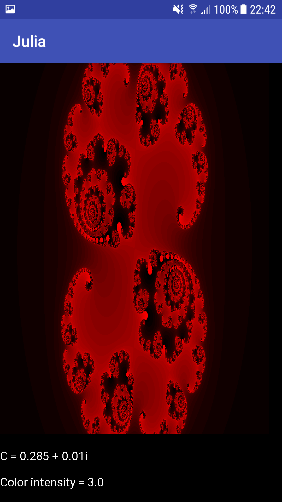

# Julia

## About the application

Julia is an application used to draw cool pictures based on the work of the mathematician Gaston Julia. All you have to do is choose a color, a complex number and a color intensity and click on the draw button to get your cool picture. If you don't have any imagination and can't come up with numbers, just press the randomize button to get a random picture.
 
 

## About the project

The purpose with this project was primarily to learn how to make android applications using Android Studio. The Julia project provided a perfect amount of challenge when learning working with a new environment. The project required me to create different activites, creating layouts and also implementing the logic regarding Julia sets.

### How to draw Julia sets

This application uses the recursive function fn+1 = fn2+C where C is specified by the user. For each pixel, take the pixel's x-position as the real part of f0 and the y-position as the imaginary part of f0. If the recursive function diverges, paint the pixel with a color intensity that depends on the amount of recursions needed for |fn| > 4. If the recursive function does not diverge, paint the pixel black.

## How to install the game
**Note** that the application can only be installed on android units

1. Go to the latest [release](https://github.com/Robert-Mellberg/Julia/releases/tag/v1.0) with the android application
2. Download the APK file called Julia.apk
3. Press open file when prompted to do so
4. Press install
5. Start the game by launching the application

## Contact information
Robert Mellberg

robmel@kth.se
